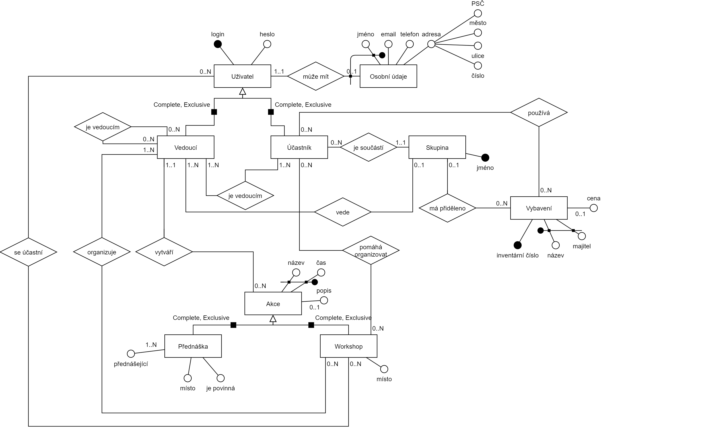

# Databáze organizace tábora - Jakub Pelc

## Motivace

Vytvořím databázi pro organizaci letní školy astronomie, kde letos sám budu vedoucím. Motivuje mě tedy tvorba webové / mobilní aplikace, kterou pro organizaci chci vytvořit.

Aplikace by měla zjednodušit plánování různých akcí a umožnila by lepší organizaci rozmístění účastníků na ně přihlášených. Stejně tak by umožnila lehčí rozdělení a sledování půjčované techniky.

### Uživatel
Uživatel má **login** a **heslo**. Každý **uživatel** má také 0..1 **osobní údaje** *(Jméno a Příjmení, Email, Telefon, Adresa)*.

### Vedoucí
**Uživatel** může být **účastník** nebo **vedoucí**. I **vedoucí** může mít **vedoucího** (hlavní vedoucí).

Každý **vedoucí** má 0..1 **skupin** které vede.

Každý **účastník** je součástí právě jedné **skupiny**, kterou vede 1..N **vedoucích**.

### Skupina
Skupina má **název**, **účastníky** a **vedoucí**. **Skupina** může mít 0..N **účastníků** a 1..N **vedoucího**.

Na táboře je také doptupné **vybavení** (dalekohledy, fotoaparáty apod.), každá **skupina** má přiděleno určité **vybavení**. Vybavení má **inventární číslo**, **název**, **majitele** a může mít **cenu**. Každý kus **vybavení** může v daný moment **používat** nějaký **účastník** (je za něj zodpovědný).

### Akce
Na táboře se pořádají **akce**, každá **akce** má **název**, **čas** kdy se koná a může mít **popis** (například snídaně 11:00).

**Akce** může být **přednáškou** (ta má **přednášející**, **místo** konání, informaci jestli je **povinná**), nebo **workshop** (ten má **organizátory**, **místo** konání a **účastníky**).

**Vedoucí** může **vytvořit** akci, přednášku nebo workshop (ten **organizuje**), a může se **přihlásit** na workshop.

Účastníci se mohou **přihlásit** na workshop a mohou **organizovat** workshop.

## ER Diagram

ER Diagram by mohl vypadat následujícím způsobem:

