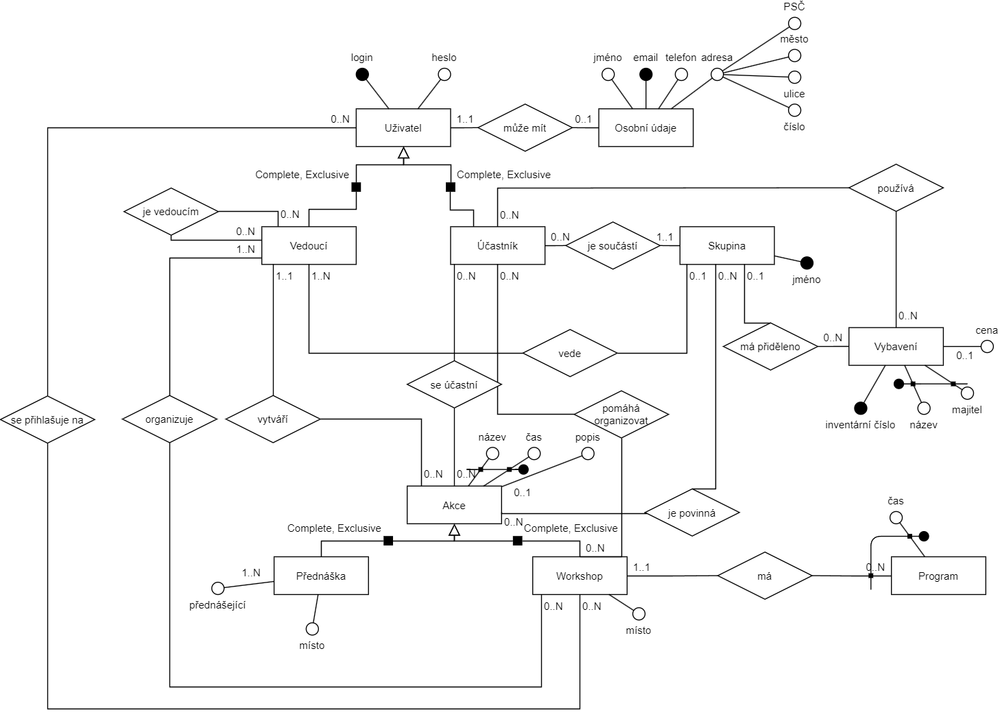

# Konceptuální model

# Relační model

- Uživatel (<u>login</u>, heslo)

- Osobní Údaje (<u>login</u>, jméno, <u>email</u>, telefon, PSČ, město, ulice, číslo)
	- FK: (login) ⊆ Uživatel(login)

- Vedoucí (<u>login</u>)
	- FK: (login) ⊆ Uživatel(login)

- Účastník (<u>login</u>)
	- FK: (login) ⊆ Uživatel(login)

- Skupina (<u>jméno</u>)

- Akce (<u>název, čas</u>, popis)

- Přednáška (<u>akce</u>, místo)
	- FK: (akce) ⊆ Akce(název, čas)

- Přednášející (<u>jméno, přednáška</u>)
	- FK: (přednáška) ⊆ Přednáška(akce)

- Workshop (<u>akce</u>, místo)
	- FK: (akce) ⊆ Akce(název, čas)

- Program (<u>workshop, čas</u>)
	- FK: (workshop) ⊆ Workshop(akce)

- Vybavení (<u>inventární číslo</u>, <u>název, majitel</u>, cena)

- Má přiděleno (<u>skupina, vybavení</u>)
	- FK: (skupina) ⊆ Skupina(jméno)
	- FK: (vybavení) ⊆ Vybavení(inventární číslo)

- Používá (<u>účastník, vybavení</u>)
	- FK: (účastník) ⊆ Účastník(login)
	- FK: (vybavení) ⊆ Vybavení(inventární číslo)

- Je součástí (<u>skupina, účastník</u>)
	- FK: (skupina) ⊆ Skupina(jméno)
	- FK: (účastník) ⊆ Účastník(login)

- Vede (<u>skupina, vedoucí</u>)
	- FK: (skupina) ⊆ Skupina(jméno)
	- FK: (vedoucí) ⊆ Vedoucí(login)

- Se přihlašuje na (<u>uživatel, workshop</u>)
	- FK: (uživatel) ⊆ Uživatel(login)
	- FK: (workshop) ⊆ Workshop(akce)

- Organizuje (<u>vedoucí, workshop</u>)
	- FK: (vedoucí) ⊆ Vedoucí(login)
	- FK: (workshop) ⊆ Workshop(akce)

- Vytváří (<u>vedoucí, akce</u>)
	- FK: (vedoucí) ⊆ Vedoucí(login)
	- FK: (akce) ⊆ Akce(název, čas)

- Pomáhá organizovat (<u>účastník, workshop</u>)
	- FK: (účastník) ⊆ Účastník(login)
	- FK: (workshop) ⊆ Workshop(akce)

- Je povinná (<u>akce, skupina</u>)
	- FK: (akce) ⊆ Akce(název, čas)
	- FK: (skupina) ⊆ Skupina(jméno)

- Je vedoucím (<u>nadřízený, podřízený</u>)
	- FK: (nadřízený) ⊆ Vedoucí(login)
	- FK: (podřízený) ⊆ Vedoucí(login)

- Se účastní (<u>účastník, akce</u>)
	- FK: (účastník) ⊆ Účastník(login)
	- FK: (akce) ⊆ Akce(název, čas)