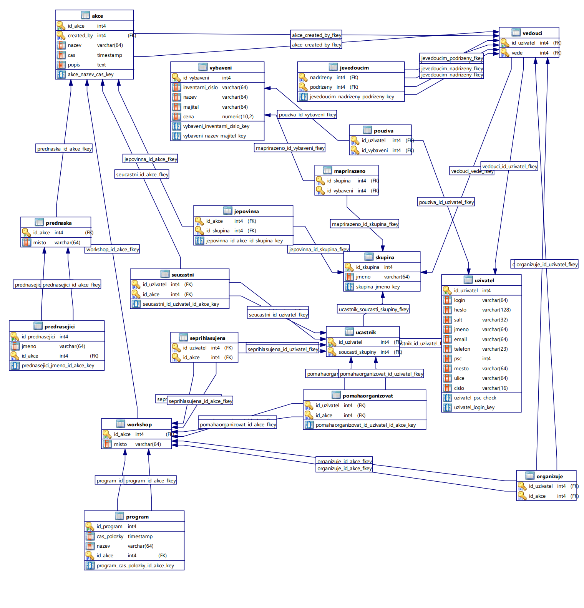
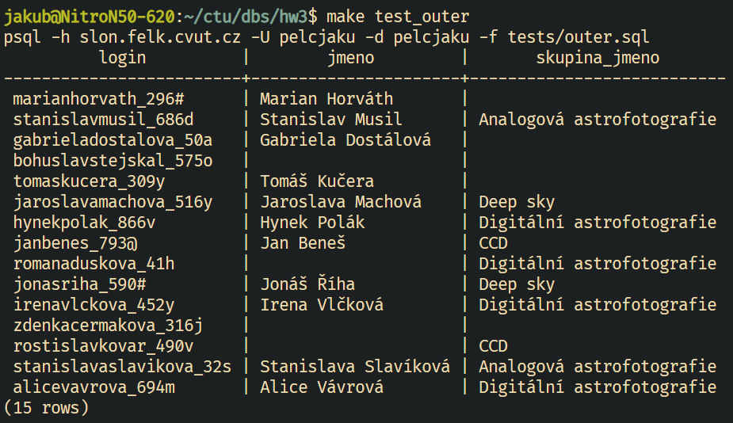

# Konceptuální model


# Relační model

- Uživatel (<u>login</u>, heslo)

- Osobní Údaje (<u>login</u>, jméno, <u>email</u>, telefon, PSČ, město, ulice, číslo)
	- FK: (login) ⊆ Uživatel(login)

- Vedoucí (<u>login</u>)
	- FK: (login) ⊆ Uživatel(login)

- Účastník (<u>login</u>)
	- FK: (login) ⊆ Uživatel(login)

- Skupina (<u>jméno</u>)

- Akce (<u>název, čas</u>)

- AkcePopis (<u>název, čas, popis</u>)
	- FK: (název, čas) ⊆ Akce(název, čas)

- Přednáška (<u>název, čas</u>, místo)
	- FK: (název, čas) ⊆ Akce(název, čas)

- Přednášející (<u>jméno, název, čas</u>)
	- FK: (název, čas) ⊆ Přednáška(název, čas)

- Workshop (<u>název, čas</u>, místo)
	- FK: (název, čas) ⊆ Akce(název, čas)

- Program (<u>čas položky, název, čas</u>)
	- FK: (název, čas) ⊆ Workshop(název, čas)

- Vybavení (<u>inventární číslo</u>, <u>název, majitel</u>)

- VybaveníCena (<u>inventární číslo, cena</u>)
	- FK: (inventární číslo) ⊆ Vybavení(inventární číslo)

- Má přiděleno (<u>skupina, vybavení</u>)
	- FK: (skupina) ⊆ Skupina(jméno)
	- FK: (vybavení) ⊆ Vybavení(inventární číslo)

- Používá (<u>účastník, vybavení</u>)
	- FK: (účastník) ⊆ Účastník(login)
	- FK: (vybavení) ⊆ Vybavení(inventární číslo)

- Je součástí (<u>skupina, účastník</u>)
	- FK: (skupina) ⊆ Skupina(jméno)
	- FK: (účastník) ⊆ Účastník(login)

- Vede (<u>skupina, vedoucí</u>)
	- FK: (skupina) ⊆ Skupina(jméno)
	- FK: (vedoucí) ⊆ Vedoucí(login)

- Se přihlašuje na (<u>uživatel, workshop</u>)
	- FK: (uživatel) ⊆ Uživatel(login)
	- FK: (workshop) ⊆ Workshop(akce)

- Organizuje (<u>vedoucí, workshop</u>)
	- FK: (vedoucí) ⊆ Vedoucí(login)
	- FK: (workshop) ⊆ Workshop(akce)

- Vytváří (<u>vedoucí, akce</u>)
	- FK: (vedoucí) ⊆ Vedoucí(login)
	- FK: (akce) ⊆ Akce(název, čas)

- Pomáhá organizovat (<u>účastník, workshop</u>)
	- FK: (účastník) ⊆ Účastník(login)
	- FK: (workshop) ⊆ Workshop(akce)

- Je povinná (<u>akce, skupina</u>)
	- FK: (akce) ⊆ Akce(název, čas)
	- FK: (skupina) ⊆ Skupina(jméno)

- Je vedoucím (<u>nadřízený, podřízený</u>)
	- FK: (nadřízený) ⊆ Vedoucí(login)
	- FK: (podřízený) ⊆ Vedoucí(login)

- Se účastní (<u>účastník, akce</u>)
	- FK: (účastník) ⊆ Účastník(login)
	- FK: (akce) ⊆ Akce(název, čas)

<div style="page-break-after: always;"></div>

# ER Model



<div style="page-break-after: always;"></div>

# SQL Tabulky

```sql
CREATE TABLE Uzivatel (
	id_uzivatel SERIAL PRIMARY KEY,
	login VARCHAR(64) NOT NULL,
	heslo VARCHAR(128) NOT NULL,
	salt VARCHAR(32) NOT NULL,
	jmeno VARCHAR(64),
	email VARCHAR(64),
	telefon VARCHAR(23),
	psc INTEGER CHECK (psc >= 10000 AND psc <= 99999),
	mesto VARCHAR(64),
	ulice VARCHAR(64),
	cislo VARCHAR(16),
	UNIQUE (login)
);

CREATE TABLE Skupina (
	id_skupina SERIAL PRIMARY KEY,
	jmeno VARCHAR(64) NOT NULL,
	UNIQUE (jmeno)
);

/* ON DELETE CASCADE je použito, protože pokud smažeme uživatele, tak záznam v tabulce vedoucích ztrácí smysl. */
/* ON UPDATE CASCADE je použito, protože pokud změníme skupinu kterou vedoucí vede, musíme také změnit skupinu v tabulce vedoucích. */
CREATE TABLE Vedouci (
	id_uzivatel INTEGER PRIMARY KEY,
	vede INT,
	FOREIGN KEY (id_uzivatel) REFERENCES Uzivatel ON DELETE CASCADE,
	FOREIGN KEY (vede) REFERENCES Skupina(id_skupina) ON UPDATE CASCADE
);

/* ON DELETE a ON UPDATE CASCADE je podobné jako u tabulky Vedouci. */
CREATE TABLE Ucastnik (
	id_uzivatel INTEGER PRIMARY KEY,
	soucasti_skupiny INT NOT NULL,
	FOREIGN KEY (id_uzivatel) REFERENCES Uzivatel ON DELETE CASCADE,
	FOREIGN KEY (soucasti_skupiny) REFERENCES Skupina(id_skupina) ON UPDATE CASCADE
);
```
<div style="page-break-after: always;"></div>

```sql
/* Po smazání uživatele smažeme akce které vytvořil. */
CREATE TABLE Akce (
	id_akce SERIAL PRIMARY KEY,
	created_by INTEGER NOT NULL,
	nazev VARCHAR(64) NOT NULL,
	cas TIMESTAMP NOT NULL,
	popis TEXT,
	UNIQUE (nazev, cas),
	FOREIGN KEY (created_by) REFERENCES Vedouci(id_uzivatel) ON DELETE CASCADE
);
/* Při smazání akce, smažeme i záznam v tabulce Prednaska. */
CREATE TABLE Prednaska (
	id_akce INTEGER PRIMARY KEY,
	FOREIGN KEY (id_akce) REFERENCES Akce ON DELETE CASCADE,
	misto VARCHAR(64) NOT NULL
);
/* Při smazání akce, smažeme i záznam v tabulce Prednasejici. */
CREATE TABLE Prednasejici (
	id_prednasejici SERIAL PRIMARY KEY,
	jmeno VARCHAR(64) NOT NULL,
	id_akce INTEGER NOT NULL,
	FOREIGN KEY (id_akce) REFERENCES Prednaska ON DELETE CASCADE,
	UNIQUE (jmeno, id_akce)
);
/* Při smazání akce, smažeme i záznam v tabulce Workshop. */
CREATE TABLE Workshop (
	id_akce INTEGER PRIMARY KEY,
	FOREIGN KEY (id_akce) REFERENCES Akce ON DELETE CASCADE,
	misto VARCHAR(64) NOT NULL
);
/* Při smazání akce, smažeme i záznam v tabulce Program. */
CREATE TABLE Program (
	id_program SERIAL PRIMARY KEY,
	cas_polozky TIMESTAMP NOT NULL,
	nazev VARCHAR(64) NOT NULL,
	id_akce INTEGER NOT NULL,
	FOREIGN KEY (id_akce) REFERENCES Workshop ON DELETE CASCADE,
	UNIQUE (cas_polozky, id_akce)
);

CREATE TABLE Vybaveni (
	id_vybaveni SERIAL PRIMARY KEY,
	inventarni_cislo VARCHAR(64) NOT NULL,
	nazev VARCHAR(64) NOT NULL,
	majitel VARCHAR(64) NOT NULL,
	cena DECIMAL(10,2),
	UNIQUE (inventarni_cislo),
	UNIQUE (nazev, majitel)
);
```
<div style="page-break-after: always;"></div>

```sql
/* Při změně / smazání skupiny nebo vybavení, musíme smazat i záznam v MaPrirazeno */
CREATE TABLE MaPrirazeno (
	id_skupina INTEGER NOT NULL,
	id_vybaveni INTEGER NOT NULL,
	FOREIGN KEY (id_skupina) REFERENCES Skupina ON DELETE CASCADE,
	FOREIGN KEY (id_vybaveni) REFERENCES Vybaveni ON DELETE CASCADE,
);
/* Při smazání uživatele nebo vybaveni, smažeme i záznam v tabulce Pouziva. */
CREATE TABLE Pouziva (
	id_uzivatel INTEGER NOT NULL,
	id_vybaveni INTEGER NOT NULL,
	FOREIGN KEY (id_uzivatel) REFERENCES Uzivatel ON DELETE CASCADE,
	FOREIGN KEY (id_vybaveni) REFERENCES Vybaveni ON DELETE CASCADE
);
/* Při smazání akce nebo uživatele, smažeme i záznam v tabulce SePrihlasujeNa. */
CREATE TABLE SePrihlasujeNa (
	id_uzivatel INTEGER NOT NULL,
	id_akce INTEGER NOT NULL,
	FOREIGN KEY (id_uzivatel) REFERENCES Ucastnik ON DELETE CASCADE,
	FOREIGN KEY (id_akce) REFERENCES Workshop ON DELETE CASCADE,
);
/* Při smazání vedoucího nebo akce, smažeme i záznam v tabulce Organizuje. */
CREATE TABLE Organizuje (
	id_uzivatel INTEGER NOT NULL,
	id_akce INTEGER NOT NULL,
	FOREIGN KEY (id_uzivatel) REFERENCES Vedouci ON DELETE CASCADE,
	FOREIGN KEY (id_akce) REFERENCES Workshop ON DELETE CASCADE,
	UNIQUE (id_uzivatel, id_akce)
);
/* Při smazání účastníka nebo akce, smažeme i záznam v tabulce PomahaOrganizovat. */
CREATE TABLE PomahaOrganizovat (
	id_uzivatel INTEGER NOT NULL,
	id_akce INTEGER NOT NULL,
	FOREIGN KEY (id_uzivatel) REFERENCES Ucastnik ON DELETE CASCADE,
	FOREIGN KEY (id_akce) REFERENCES Workshop ON DELETE CASCADE,
	UNIQUE (id_uzivatel, id_akce)
);
/* Při smazání akce nebo skupiny smažeme i záznam v tabulce JePovinna. */
CREATE TABLE JePovinna (
	id_akce INTEGER NOT NULL,
	id_skupina INTEGER NOT NULL,
	FOREIGN KEY (id_akce) REFERENCES Akce ON DELETE CASCADE,
	FOREIGN KEY (id_skupina) REFERENCES Skupina ON DELETE CASCADE,
	UNIQUE (id_akce, id_skupina)
);
```
<div style="page-break-after: always;"></div>

```sql
/* Při smazání vedoucího - podřízeného nebo nadřízeného, smažeme i záznam v tabulce JeVedoucim. */
CREATE TABLE JeVedoucim (
	nadrizeny INTEGER NOT NULL,
	podrizeny INTEGER NOT NULL,
	FOREIGN KEY (nadrizeny) REFERENCES Vedouci(id_uzivatel) ON DELETE CASCADE,
	FOREIGN KEY (podrizeny) REFERENCES Vedouci(id_uzivatel) ON DELETE CASCADE,
	UNIQUE (nadrizeny, podrizeny)
);

/* Při smazání účastníka nebo akce, smažeme i záznam v tabulce SeUcastni. */
CREATE TABLE SeUcastni (
	id_uzivatel INTEGER NOT NULL,
	id_akce INTEGER NOT NULL,
	FOREIGN KEY (id_uzivatel) REFERENCES Ucastnik ON DELETE CASCADE,
	FOREIGN KEY (id_akce) REFERENCES Akce ON DELETE CASCADE,
	UNIQUE (id_uzivatel, id_akce)
);
```

## Data

Pro generování dat jsem použil knihovnu `faker`, data jsem vygeneroval do `.sql` souborů, které pak za pomoci `psql` nahrávám na server.

Data vkládám pomocí

```sql
INSERT INTO Tabulka
	(sloupce, ..., ...) VALUES
	('val1', 'val2', 'val3'),
	('val4', 'val5', 'val6');
```

## SQL Dotazy

Vylistování všech vedoucích (a skupin které vedou), kteří nemají vyplněno telefonní číslo.
```sql
SELECT Uzivatel.login, Uzivatel.jmeno, Skupina.jmeno AS skupina_jmeno FROM Uzivatel
	INNER JOIN Vedouci ON Uzivatel.id_uzivatel = Vedouci.id_uzivatel
	INNER JOIN Skupina ON Vedouci.vede = Skupina.id_skupina
	WHERE Uzivatel.telefon IS NULL
	ORDER BY Uzivatel.login ASC LIMIT 10;
```


Výpis všech akcí, které se konaly v prvním týdnu v dubnu (vždy mezi půlnocí a 8:00), s uživateli, kterými byly vytvořeny.
```sql
SELECT Akce.nazev, Akce.cas, Uzivatel.jmeno AS zalozil FROM Akce
	INNER JOIN Vedouci ON Akce.created_by = Vedouci.id_uzivatel
	INNER JOIN Uzivatel ON Vedouci.id_uzivatel = Uzivatel.id_uzivatel
	WHERE Akce.cas >= '2024-04-01' AND Akce.cas <= '2024-04-07' AND EXTRACT(HOUR FROM Akce.cas) >= 0 AND EXTRACT(HOUR FROM Akce.cas) < 8
	ORDER BY Akce.cas ASC;
```


Zobrazí uživatele, kteří se přihlásili na nejvíce workshopů.
```sql
SELECT Uzivatel.login, Uzivatel.jmeno, COUNT(*) AS pocet FROM Uzivatel
	INNER JOIN SePrihlasujeNa ON Uzivatel.id_uzivatel = SePrihlasujeNa.id_uzivatel
	GROUP BY Uzivatel.jmeno, Uzivatel.login
	ORDER BY pocet DESC
	LIMIT 10;
```


Vypíše přes vnořený SELECT všechny kusy vybavení (název, majitele, cenu, inventárni číslo), která mají cenu, která je vyšší než 10000 korun, a vybavení (název) začíná na `Fujifilm`, `DJI` nebo `RED Digital Cinema`.
```sql
SELECT nazev, majitel, cena, inventarni_cislo FROM Vybaveni
	WHERE cena > 10000 AND nazev IN (
		SELECT nazev FROM Vybaveni
			WHERE nazev LIKE 'Fujifilm%' OR nazev LIKE 'DJI%' OR nazev LIKE 'RED Digital Cinema%'
	)
	ORDER BY cena DESC, nazev ASC
	LIMIT 10;
```


<div style="page-break-after: always;"></div>

Spočítá průměrnou cenu vybavení, které je buďto `Canon EOS 5D`, `Canon EOS 6D` nebo `Canon EOS 7D`.

```sql
SELECT AVG(cena) FROM Vybaveni
	WHERE nazev IN ('Canon EOS 5D', 'Canon EOS 6D', 'Canon EOS 7D') AND cena IS NOT NULL;
```


Zobrazí skupiny, které mají průměrnou cenu vybavení vyšší než 25 500.
```sql
SELECT Skupina.jmeno, AVG(Vybaveni.cena) AS prumerna_cena FROM Skupina
	JOIN MaPrirazeno ON Skupina.id_skupina = MaPrirazeno.id_skupina
	JOIN Vybaveni ON MaPrirazeno.id_vybaveni = Vybaveni.id_vybaveni
	GROUP BY Skupina.jmeno
	HAVING AVG(Vybaveni.cena) > 25500 ORDER BY prumerna_cena DESC;
```


Zobrazí druhých 10 vybavení s cenou v rozmezí 10-15k zaokrouhlenou na celá čísla, seřazených podle ceny, jména a jména majitele.
```sql
SELECT Vybaveni.nazev, Vybaveni.majitel, ROUND(Vybaveni.cena) AS cena FROM Vybaveni
	WHERE Vybaveni.cena >= 10000 AND Vybaveni.cena <= 15000
	ORDER BY cena, Vybaveni.nazev, Vybaveni.majitel
	LIMIT 10 OFFSET 10;
```


Vypíše login, jméno, id skupiny a jméno skupiny uživatelů, kteří jsou v nějaké skupině. Pokud uživatel není v žádné skupině, vypíše se NULL.
```sql
SELECT U.login, U.jmeno, S.jmeno AS skupina_jmeno
FROM Uzivatel U
LEFT OUTER JOIN Ucastnik UC ON U.id_uzivatel = UC.id_uzivatel
LEFT OUTER JOIN Skupina S ON UC.soucasti_skupiny = S.id_skupina
ORDER BY U.id_uzivatel ASC LIMIT 15;
```
