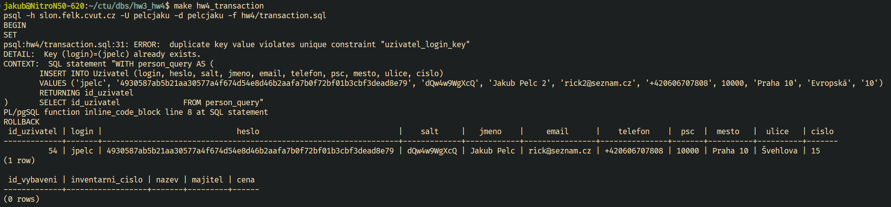
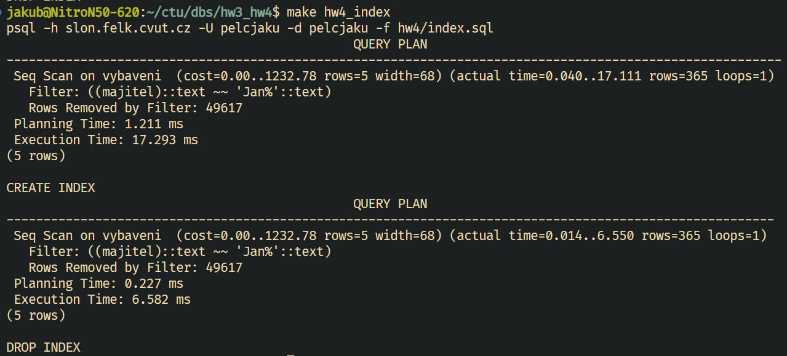
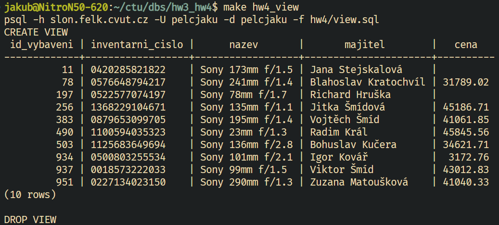
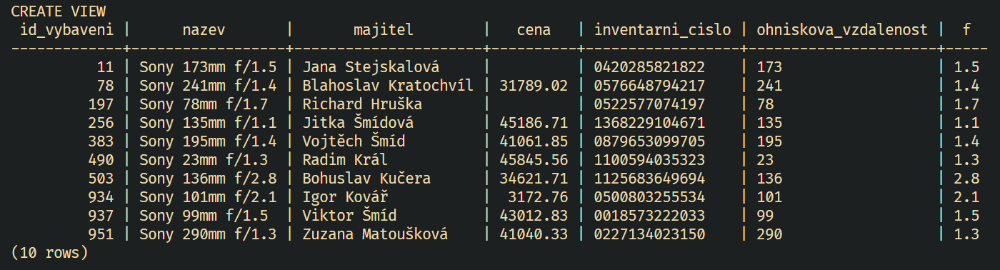
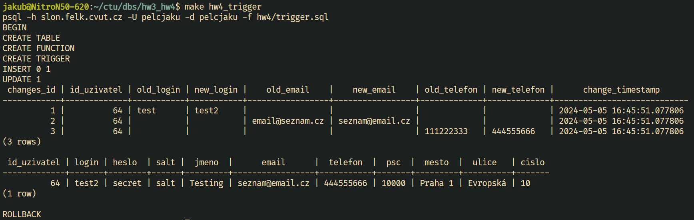

# Transakce

```sql
BEGIN TRANSACTION;
SET TRANSACTION ISOLATION LEVEL READ COMMITTED;

DO

$$
DECLARE
	id_user INT;
	id_tool INT;

BEGIN

WITH person_query AS (
	INSERT INTO Uzivatel (login, heslo, salt, jmeno, email, telefon, psc, mesto, ulice, cislo)
	VALUES ('jpelc', '4930587ab5b21aa30577a4f674d54e8d46b2aafa7b0f72bf01b3cbf3dead8e79', 'dQw4w9WgXcQ', 'Jakub Pelc 2', 'rick2@seznam.cz', '+420606707808', 10000, 'Praha 10', 'Evropská', '10')
	RETURNING id_uzivatel
)	SELECT id_uzivatel INTO id_user FROM person_query;


WITH tool_query AS (
	INSERT INTO Vybaveni (inventarni_cislo, nazev, majitel, cena)
	VALUES ('FEE_0001', 'NixOS Laptop', 'Jakub Pelc', 100.00)
	RETURNING id_vybaveni
) SELECT id_vybaveni INTO id_tool FROM tool_query;

INSERT INTO Pouziva (id_uzivatel, id_vybaveni)
VALUES (id_user, id_tool);

END;

$$;

COMMIT;

SELECT * FROM Uzivatel WHERE login = 'jpelc';
SELECT * FROM Vybaveni WHERE inventarni_cislo = 'FEE_0001';
```

Vytvoří nového uživatele a kus vybavení, které mu přiřadí. Pokud by nebyla použita transakce, mohlo by dojít k situaci, kdy by byl vytvořen uživatel, ale vybavení by nebylo vytvořeno, nebo naopak. Transakce zajistí, že se všechny operace provedou nebo žádná (může selhat vytvoření uživatele kvůli kolizi username nebo inventárního čísla vybavení nástroje / kombinace majitele a názvu vybavení).

Isolation layer je nastavena na `READ COMMITTED`, jelikož při transakci z tabulky nečtu.

Při kolizi se použije `ROLLBACK`, jinak dojde ke `COMMIT`.

V příkladu lze vidět, že nedošlo ke změně uživatele, ani k vytvoření nového vybavení, jelikož selhal `INSERT` do tabulky `Uzivatel`.



# Indexy

```sql
EXPLAIN ANALYZE SELECT * FROM Vybaveni WHERE majitel LIKE 'Jan%';

CREATE INDEX idx_vybaveni_majitel ON Vybaveni (majitel);

EXPLAIN ANALYZE SELECT * FROM Vybaveni WHERE majitel LIKE 'Jan%';

DROP INDEX idx_vybaveni_majitel;
```

Vytvořil jsem index na tabulce `Vybaveni`, sloupec `majitel`. Rychlost jsem testoval přes `EXPLAIN ANALYZE`.



<div style="page-break-after: always;"></div>

# Pohled

```sql
CREATE VIEW Objektiv AS
	SELECT *
	FROM Vybaveni
	WHERE nazev LIKE '%f/%';

SELECT * FROM Objektiv WHERE nazev LIKE 'Sony%' ORDER BY id_vybaveni ASC LIMIT 10;
```

Vytvoří pohled na objektivy v tabulce vybavení (ty v názvu obsahují f číslo). Poté mohu přistupovat na pohled Objektiv jako na tabulku (zde vylistování všech objektivů od Sony).



```sql
CREATE VIEW Objektiv AS
SELECT 
	id_vybaveni,
	nazev,
	majitel,
	cena,
	inventarni_cislo,
	SUBSTRING(nazev FROM '(\d+)mm') AS ohniskova_vzdalenost,
	SUBSTRING(nazev FROM 'f/(\d+(\.\d+)?)') AS f
FROM
	Vybaveni
WHERE 
	nazev LIKE '%f/%';

SELECT * FROM Objektiv WHERE nazev LIKE 'Sony%' ORDER BY id_vybaveni ASC LIMIT 10;
```

Tento pohled extrahuje informace o ohniskové vzdálenosti a clonovém čísle z názvu objektivu do separátních sloupců.



<div style="page-break-after: always;"></div>

# Trigger

```sql
--transakce, k ošetření vkládání duplicitního uživatele
BEGIN TRANSACTION;
SET TRANSACTION ISOLATION LEVEL READ COMMITTED;

--tabulka, která trackuje změny v důležitých informacích uživatele
CREATE TABLE UzivatelChanges (
	changes_id SERIAL PRIMARY KEY,
	id_uzivatel INTEGER NOT NULL,
	old_login VARCHAR(64),
	new_login VARCHAR(64),
	old_email VARCHAR(64),
	new_email VARCHAR(64),
	old_telefon VARCHAR(23),
	new_telefon VARCHAR(23),
	change_timestamp TIMESTAMP DEFAULT CURRENT_TIMESTAMP,
	FOREIGN KEY (id_uzivatel) REFERENCES Uzivatel(id_uzivatel)
);

--user funkce, která vloží změny do tabulky, pokud jsou jiné než předchozí
CREATE OR REPLACE FUNCTION update_uzivatel()
RETURNS TRIGGER AS $$
BEGIN
	IF OLD.login <> NEW.login THEN
		INSERT INTO UzivatelChanges (id_uzivatel, old_login, new_login)
		VALUES (OLD.id_uzivatel, OLD.login, NEW.login);
	END IF;

	IF OLD.email <> NEW.email THEN
		INSERT INTO UzivatelChanges (id_uzivatel, old_email, new_email)
		VALUES (OLD.id_uzivatel, OLD.email, NEW.email);
	END IF;

	IF OLD.telefon <> NEW.telefon THEN
		INSERT INTO UzivatelChanges (id_uzivatel, old_telefon, new_telefon)
		VALUES (OLD.id_uzivatel, OLD.telefon, NEW.telefon);
	END IF;
	
	RETURN NEW;
END;
$$ LANGUAGE plpgsql;

--trigger pro vložení po updatu dat
CREATE OR REPLACE TRIGGER trigger_update_uzivatel
AFTER UPDATE ON Uzivatel
FOR EACH ROW
EXECUTE FUNCTION update_uzivatel();
```
<div style="page-break-after: always;"></div>

```sql
--příklad použití
INSERT INTO Uzivatel (login, heslo, salt, jmeno, email, telefon, psc, mesto, ulice, cislo) VALUES ('test' , 'secret', 'salt', 'Testing', 'email@seznam.cz', '111222333', 10000, 'Praha 1', 'Evropská', 10);

UPDATE Uzivatel SET login = 'test2', email = 'seznam@email.cz', telefon = '444555666' WHERE login = 'test';

SELECT * FROM UzivatelChanges;
SELECT * FROM Uzivatel WHERE login = 'test2';

-- rollback pro testovací účely
ROLLBACK;
```



Tento trigger slouží ke sledování změn důležitých informací v tabulce `Uzivatel`.